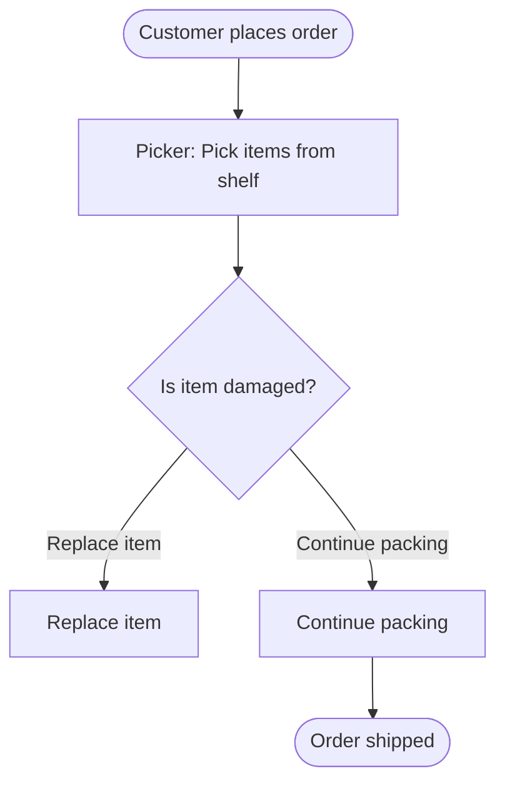

# Implementation Summary: Step Capture + Live BPMN Diagram

## Overview

Successfully implemented all planned improvements to the current-state process capture interview flow:

1. **Fixed workflow trigger capture** - Triggers are now explicitly asked and captured
2. **Added clarify_if follow-up engine** - Vague/empty answers trigger non-overbearing clarifications
3. **Conditional decision outcomes capture** - Only asks about decision paths when a decision exists
4. **Live BPMN-lite diagram generation** - Updates diagram artifact after each step

## Files Created

### `src/actions/diagram_generation.py`
- `build_bpmn_lite_mermaid()` - Generates Mermaid flowchart (BPMN-lite) from workflow maps
- `write_mermaid_artifact()` - Writes diagram to file with directory creation
- Supports start/end events, tasks, decision gateways, and outcome branches
- Sanitizes node IDs and labels for Mermaid compatibility

### `tests/unit/test_nodes.py`
- Tests for `_should_clarify()` condition checking
- Tests for clarification trigger, answer combination, and non-triggering cases
- Covers empty_or_too_short, vague, and unclear_yes_no conditions

## Files Modified

### `src/actions/workflow_actions.py`
**New Actions:**
- `write_trigger_to_active_workflow()` - Writes trigger/start/end conditions from buffer to active workflow
- `check_step_has_decision()` - Checks if step has a meaningful decision and sets flag
- `update_live_bpmn_artifact()` - Generates and writes live diagram after each step commit

### `src/nodes/interview_nodes.py`
**New Function:**
- `_should_clarify()` - Deterministic condition checker for clarify_if rules

**Enhanced Node:**
- `ingest_user_answer_node()` - Now checks clarify_if conditions and triggers follow-ups
  - Tracks clarification state in pending
  - Combines original + clarification answers
  - Prevents infinite clarification loops (max 1 follow-up)

### `flows/Flow_B_current_state_mapping_v1.json`
**Schema Changes:**
- Added `workflow_level_buffer` to capture trigger/start/end conditions
- Added `decision_outcomes` field to `active_step_buffer`
- Added `active_step_flags.has_decision` for branching logic

**Flow Changes:**
- Replaced `workflow_walkthrough_driver` loop stage with:
  - `workflow_trigger_capture` (questions stage with 2 questions)
  - `workflow_trigger_commit` (action stage)
- Split decision capture from wait/exception capture:
  - `workflow_step_capture__decision_wait_exception` → just captures decision
  - `workflow_step_check_decision` (action) → sets has_decision flag
  - `workflow_step_decision_branch` (branch) → routes based on flag
  - `workflow_step_capture__decision_outcomes` (conditional questions)
  - `workflow_step_capture__wait_exception` (always asked)
- Added diagram update stages after step commit:
  - `workflow_update_diagram` (action) → generates/writes diagram
  - `workflow_diagram_notification` (message) → tells user where file is

### `tests/unit/test_actions.py`
**New Tests:**
- `test_write_trigger_to_active_workflow()`
- `test_check_step_has_decision_yes()`
- `test_check_step_has_decision_no()`
- `test_update_live_bpmn_artifact()`
- `test_build_bpmn_lite_mermaid_basic()`
- `test_build_bpmn_lite_mermaid_with_decision()`

### `tests/integration/test_interview_graph.py`
**New Test:**
- `test_workflow_trigger_capture()` - End-to-end test of trigger question → answer → commit flow

## How It Works

### Trigger Capture Flow
1. User selects workflows
2. `initialize_workflow_maps_from_selection` creates workflow skeletons
3. `workflow_trigger_capture` stage asks 2 questions:
   - Trigger event
   - Start conditions
4. `workflow_trigger_commit` writes buffer to active workflow
5. Flow proceeds to step capture

### Clarify_If Follow-ups
1. User answers a question with clarify_if rules
2. `ingest_user_answer_node` checks conditions via `_should_clarify()`
3. If triggered, returns follow-up message and sets `is_clarifying=True` in pending
4. User answers clarification
5. Node combines original + clarification, writes to slot, advances normally

### Decision Outcomes Capture
1. Step decision question asked and answered
2. `check_step_has_decision` action analyzes the answer
3. Branch stage routes based on result:
   - `has_decision` → ask for 2-3 outcomes
   - `no_decision` → skip to wait/exception questions
4. Outcomes stored in `decision_outcomes` field

### Live Diagram Updates
1. After each step is committed via `commit_step_to_active_workflow`
2. `update_live_bpmn_artifact` action:
   - Gets active workflow from slots
   - Calls `build_bpmn_lite_mermaid()` to generate Mermaid syntax
   - Writes to `artifacts/live_bpmn_<workflow_id>.mmd`
   - Stores path in slots
3. Message stage notifies user of diagram location
4. User can view diagram in real-time as process builds

## Diagram Format (BPMN-lite)

Uses Mermaid flowchart with BPMN-inspired syntax:
- Start/End events: `([Label])`
- Tasks: `[Owner: Description]`
- Decision gateways: `{Decision?}`
- Outcome branches: `[Outcome text]` with labeled edges

Example:

## Testing Coverage

### Unit Tests
- ✅ Trigger writing to workflow
- ✅ Decision detection (yes/no cases)
- ✅ Live diagram generation and file writing
- ✅ BPMN-lite Mermaid generation (basic and with decisions)
- ✅ Clarify_if condition checking (all 3 types)
- ✅ Clarification triggering and answer combination

### Integration Tests
- ✅ End-to-end trigger capture flow in graph
- ✅ Existing tests for question answering and confirmation still pass

## Non-Goals (Deferred)

As per the plan, these remain out of scope for this iteration:
- Full BPMN 2.0 semantics (message flows, pools, subprocesses)
- Swimlane rendering in diagrams (already done at end-of-flow)
- Multi-turn clarification (limited to 1 follow-up per question)
- Loop stage implementation (converted to questions stages for now)

## Next Steps

1. Run tests: `poetry run pytest tests/`
2. Try the interview: `poetry run python -m src.cli` or `poetry run langgraph dev`
3. Check artifacts folder for live diagrams during step capture
4. Iterate based on real interview feedback
