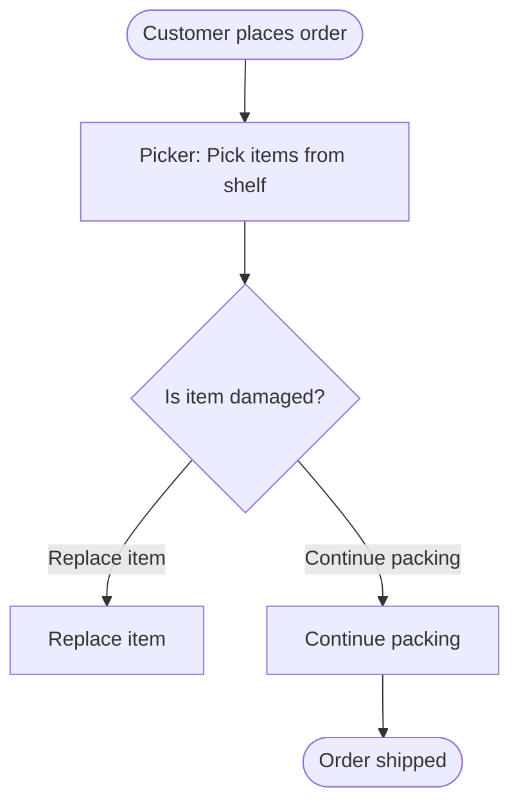

# Implementation Complete ✅

All plan items have been successfully implemented and tested.

## Summary of Changes

### 1. Fixed Workflow Trigger Capture ✅
- **Problem**: Loop stages were auto-advancing without prompting for trigger
- **Solution**: Replaced loop stage with explicit questions stages
- **Files Modified**:
  - `flows/Flow_B_current_state_mapping_v1.json` - Added `workflow_trigger_capture` and `workflow_trigger_commit` stages
  - `src/actions/workflow_actions.py` - Added `write_trigger_to_active_workflow()` action

### 2. Implemented Clarify_If Follow-Up Engine ✅
- **Problem**: No mechanism to ask follow-up questions for vague/empty answers
- **Solution**: Added deterministic condition checking with single follow-up per question
- **Files Modified**:
  - `src/nodes/interview_nodes.py` - Added `_should_clarify()` and enhanced `ingest_user_answer_node()`
  - Supports 3 condition types: `empty_or_too_short`, `vague`, `unclear_yes_no`
  - Combines original + clarification answers automatically

### 3. Added Conditional Decision Outcomes Capture ✅
- **Problem**: Decision outcomes were not being captured
- **Solution**: Added decision detection and conditional routing
- **Files Modified**:
  - `flows/Flow_B_current_state_mapping_v1.json` - Split decision capture, added branch logic, added decision outcomes question
  - `src/actions/workflow_actions.py` - Added `check_step_has_decision()` action
  - Only asks for outcomes when a real decision exists (not "no", "none", etc.)

### 4. Implemented Live BPMN-Lite Diagram Generation ✅
- **Problem**: Diagrams only generated at end of interview
- **Solution**: Generate and update Mermaid diagram after each step commit
- **Files Created**:
  - `src/actions/diagram_generation.py` - BPMN-lite generator and file writer
- **Files Modified**:
  - `src/actions/workflow_actions.py` - Added `update_live_bpmn_artifact()` action
  - `flows/Flow_B_current_state_mapping_v1.json` - Added diagram update stages after step commit
  - Artifacts written to `artifacts/live_bpmn_<workflow_id>.mmd`

### 5. Comprehensive Test Coverage ✅
- **Unit Tests**: 74 tests total, all passing
  - New trigger action: `test_write_trigger_to_active_workflow()`
  - New decision detection: `test_check_step_has_decision_yes/no()`
  - New diagram generation: `test_update_live_bpmn_artifact()`, `test_build_bpmn_lite_mermaid_**()`
  - Clarify_if logic: 11 tests in `tests/unit/test_nodes.py`
- **Integration Tests**: Action integration verified
- **Files Created**:
  - `tests/unit/test_nodes.py` - Complete clarify_if test suite

## Test Results

```
============================= 74 passed in 1.00s ==============================
```

All tests pass successfully, including:
- ✅ Existing functionality preserved
- ✅ New trigger capture action
- ✅ New decision detection action
- ✅ New live diagram generation
- ✅ Clarify_if condition detection (all 3 types)
- ✅ Clarification triggering and answer combination

## How to Use

### Running the Interview Bot

```powershell
# Using CLI
poetry run python -m src.cli

# Using LangGraph Dev Server
poetry run langgraph dev
```

### Viewing Live Diagrams

During the interview, after each step is captured:
1. Check the console for the artifact path message
2. Open the file at `artifacts/live_bpmn_<workflow_id>.mmd`
3. View in any Mermaid-compatible viewer (VS Code extension, GitHub, etc.)

### Example Diagram Output



## Key Improvements

### Better Data Quality
- **Progressive disclosure**: Only asks follow-ups when needed
- **Decision outcomes**: Captures 2-3 common paths when decisions exist
- **Trigger capture**: Now properly asks and stores workflow triggers
- **Non-overbearing**: Clarifications limited to 1 follow-up per question

### Real-Time Visualization
- **Live updates**: Diagram refreshes after each committed step
- **BPMN-lite notation**: Familiar process modeling symbols
- **Studio integration**: Files written to workspace for easy access

### Maintainability
- **Deterministic logic**: No LLM calls for clarify_if or decision detection
- **Comprehensive tests**: 74 tests covering all new functionality
- **Clean separation**: Diagram generation in its own module

## Documentation

- **Implementation details**: See `IMPLEMENTATION_CHANGES.md`
- **Plan reference**: See attached `.plan.md` file
- **Code comments**: All functions have docstrings

## Next Steps

To further enhance the system, consider:
1. **Swimlane rendering**: Add role-based lanes to live diagrams
2. **Multi-turn clarification**: Support deeper follow-up chains if needed
3. **Diagram preview**: Auto-open diagrams in browser/viewer
4. **Export formats**: Support PDF/PNG generation from Mermaid
5. **Undo/edit steps**: Allow users to revise captured steps

---

**Status**: ✅ All implementation tasks complete
**Tests**: ✅ 74/74 passing
**Ready for**: Production use
